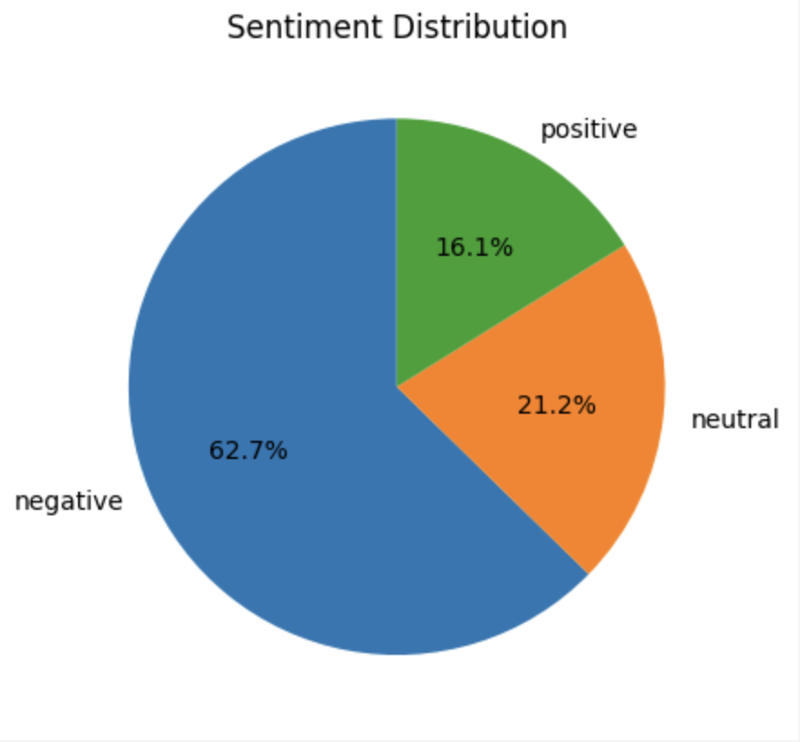
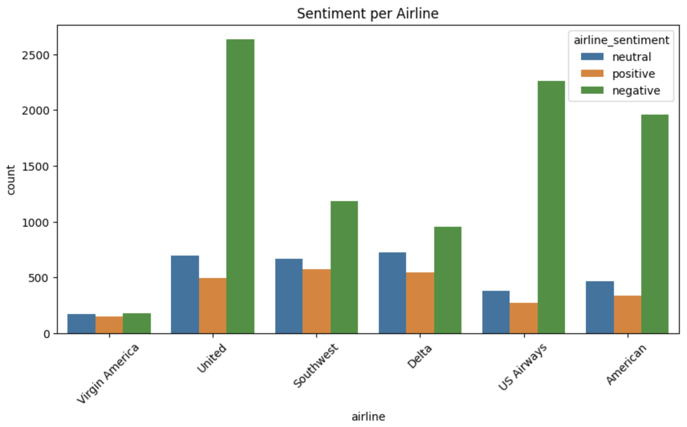
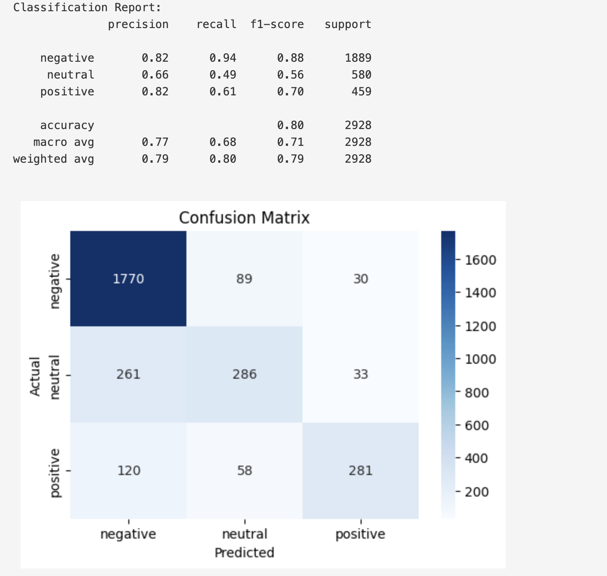
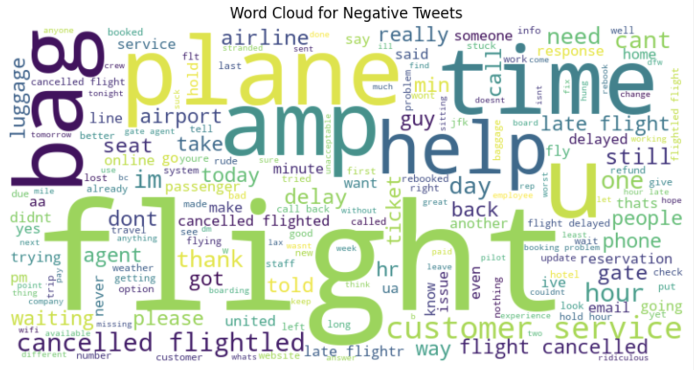

# ✈️ Airline Customer Sentiment Analysis

## 📌 Project Overview

This project performs **Sentiment Analysis on Airline Customer Tweets** using Natural Language Processing (NLP) and Machine Learning techniques.

The objective is to classify customer opinions as **Positive, Neutral, or Negative** and uncover valuable insights regarding customer experiences with different airlines.

The project demonstrates an end-to-end NLP workflow including:

- Text preprocessing
- Feature engineering using TF-IDF
- Sentiment classification using Logistic Regression
- Model evaluation
- Data visualization and insight generation

---

## 🎯 Business Objective

The goal of this project is to:

- Analyze customer feedback from airline tweets
- Identify overall customer sentiment
- Compare sentiment across airlines
- Detect common issues raised by customers
- Build a machine learning model for sentiment prediction

---

## 🛠️ Tools & Technologies

| Category | Technologies |
|-----------|-------------|
| Programming | Python |
| Data Analysis | Pandas, NumPy |
| NLP | NLTK |
| Machine Learning | Scikit-Learn |
| Visualization | Matplotlib, Seaborn, WordCloud |
| Environment | Jupyter Notebook |

---

## 📂 Dataset Information

The dataset contains airline-related tweets collected from Twitter.

### Dataset Features

- Tweet Text
- Airline Name
- Airline Sentiment
- Negative Reason
- Confidence Scores
- Tweet Metadata

### Sentiment Classes

- Positive
- Neutral
- Negative

---

## 🔄 Project Workflow

### 1️⃣ Data Collection

- Loaded airline tweets dataset
- Explored dataset structure

### 2️⃣ Data Preprocessing

- Converted text to lowercase
- Removed URLs
- Removed mentions and hashtags
- Removed special characters
- Removed stopwords
- Applied lemmatization

### 3️⃣ Feature Engineering

- TF-IDF Vectorization
- Text transformation into numerical features

### 4️⃣ Model Building

- Train-Test Split
- Logistic Regression Classification

### 5️⃣ Model Evaluation

- Classification Report
- Confusion Matrix
- Accuracy Analysis

### 6️⃣ Visualization

- Sentiment Distribution
- Airline-wise Sentiment Analysis
- Word Cloud Visualization

---

## 📊 Visualizations

### Sentiment Distribution



### Sentiment by Airline



### Confusion Matrix



### Word Cloud Analysis



---

## 🤖 Machine Learning Model

### Algorithm Used

**Logistic Regression**

### Feature Extraction

**TF-IDF Vectorization**

### Data Split

- Training Data: 80%
- Testing Data: 20%

---

## 📈 Model Performance

The model achieved approximately:

### Accuracy

**~80%**

### Evaluation Metrics

- Precision
- Recall
- F1-Score
- Confusion Matrix

The model performed particularly well in identifying negative sentiments from airline customer tweets.

---

## 🔍 Key Findings

### 😠 Customer Sentiment

Most airline tweets were classified as negative, indicating customer dissatisfaction.

### ✈️ Airline Comparison

Sentiment varied significantly across airlines.

### 📞 Common Complaints

Frequent issues included:

- Flight delays
- Customer service problems
- Cancellations
- Baggage issues

### ☁️ Word Cloud Insights

Words such as:

- flight
- plane
- service
- customer
- delayed

appeared frequently in negative tweets.

---

## 📁 Repository Structure

```text
Airline-Customer-Sentiment-Analysis
│
├── airline_sentiment_analysis.ipynb
├── requirements.txt
├── README.md
│
├── images/
│   ├── sentiment_distribution.png
│   ├── sentiment_by_airline.png
│   ├── confusion_matrix.png
│   └── wordcloud_negative_tweets.png
│
└── dataset/
```

---

## 🚀 Future Improvements

- Deploy model as a web application
- Use advanced NLP models such as BERT
- Real-time Twitter sentiment monitoring
- Multi-language sentiment analysis
- Interactive dashboard development

---

## 👩‍💻 Author

**Unnati Patil**

Aspiring Data Analyst | Business Analyst | Data Science Enthusiast

---

## ⭐ Project Highlights

✔ Natural Language Processing (NLP)

✔ Text Preprocessing & Feature Engineering

✔ Machine Learning Classification

✔ Sentiment Analysis

✔ Data Visualization & Storytelling

✔ End-to-End Analytics Project

---

### ⭐ If you found this project useful, consider giving it a star!
